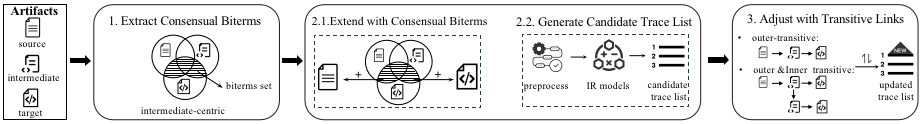

# TRIAD


This the repository for our ICSE'2024 paper **"TRIAD: Automated Traceability Recovery based on Biterm-enhanced Deduction of Transitive Links among Artifacts"**.

Traceability allows stakeholders to extract and comprehend the trace links among software artifacts introduced across the software
life cycle, to provide significant support for software engineering tasks. Despite its proven benefits, software traceability is challenging to recover and maintain manually. Hence, plenty of approaches
for automated traceability have been proposed. Most rely on textual similarities among software artifacts, such as those based on
Information Retrieval (IR). However, artifacts in different abstraction levels usually have different textual descriptions, which can
greatly hinder the performance of IR-based approaches (e.g., a requirement in natural language may have a small textual similarity
to a Java class). In this work, we leverage the consensual biterms
and transitive relationships (i.e., inner- and outer-transitive links)
based on intermediate artifacts to improve IR-based traceability
recovery. We first extract and filter biterms from all source, intermediate, and target artifacts. We then use the consensual biterms
from the intermediate artifacts to enrich the texts of both source
and target artifacts, and finally deduce outer and inner-transitive
links to adjust text similarities between source and target artifacts.
We conducted a comprehensive empirical evaluation based on five
systems widely used in other literature to show that our approach
can outperform four state-of-the-art approaches in AP over 15%
and MAP over 10% on average, and how its performance is affected
by different conditions of source, intermediate, and target artifacts.




## Running TRIAD
### Running for RQ1: *To what extent does TRIAD exceed the performance of baseline approaches?*
* run `main()` in `RunWithBaseline.java`
* set evaluated project by `projectEnum` parameter
* set evaluated ir model by `irEnum` parameter
* four baselines include IR-ONLY, [TAROT](https://dl.acm.org/doi/10.1145/3551349.3556948), [LIA](https://ieeexplore.ieee.org/document/9609143), and [COMET](https://dl.acm.org/doi/10.1145/3377811.3380418)


### Running for RQ2: *What is the individual impact of biterms, outer- and inner-transitive on performance?*
* run `main()` in `RunTRIAD.java`.
* set evaluated project by `projectEnum` parameter
* set evaluated ir model by `irEnum` parameter


### Code Structures

``` 
├── RunWithBaselines.java             <- Run result for RQ1.
│
├── RunTRIAD.java                     <- Run result for RQ2.
│
├── approach                          <- TRIAD and four approaches.
│   ├── TRAID.java                    <- Implemention of TRIAD.
│   ├── TRAID_NoBiterm.java           <- Implemention of TRIAD without biterms.
│   ├── TAROT.java                    <- Implemention of TAROT.
│   ├── COMET.java                    <- Implemention of COMET.
│   └── LIA.java                      <- Implemention of LIA.
│
├── experiment                        <- Contain all information about the experiment.
│   ├── preprocess                    <- Preprocess datasets, including text preprocess and biterms extraction.
│   ├── project                       <- Information of evaluated projects.
│   ├── transitive                    <- Two types of transitive strategies.
│   │   ├── OuterTransitive.java      <- Only consider outer-transitive links (e.g., S1→I1→T1).
│   │   └── OuterInnerTransitive.java <- Consider outer-inner combined transitive links (e.g., S1→S2→I1→T1 and S1→I1→I2→T1 ).
│   ├── enum                          <- Enum types used in this project.
│   └── Result.java                   <- Result of each approach.
│
├── model                             <- Three IR models (i.e., VSM, LSI, and JSD).
│   ├── VSM                           <- VSM model.
│   ├── LSI                           <- LSI model.
│   └── JSD                           <- JSD model.
│
├── document                          <- Model artifacts and links into entity classes.
│
└── util                              <- Utilities class used in the project.
```

## Datasets

Overview of the five evaluated systems:
<table style="border-collapse: collapse; margin-left:15px; ">
    <tr style="border-bottom: 1px solid gray">
        <th style="padding-right:15px">Dataset</th><th style="padding-right:15px">source</th><th style="padding-right:15px">Intermediate</th><th style="padding-right:15px">Target</th><th style="padding-right:15px">S→I</th><th style="padding-right:15px">I→T</th><th style="padding-right:15px">I→T</th>
    </tr>
    <tr><td>Dronology</td> <td>Requirement:58</td> <td>Design Definitions:144</td> <td>Source Code:184</td> <td>Req→DD:132</td> <td>DD→Src:563</td> <td>Req→Src:393</td></tr>
    <tr><td>WARC</td><td>Non-Func. Reqs:21</td> <td>Specifications:89 <td>Func. Reqs:42</td> <td>NFR→SRS:58</td> <td>SRS→FRS:78</td> <td>NFR→FRS:45</td></tr>
    <tr><td>EasyClinic</td> <td>Use Case:30</td> <td>Interaction Descr.:20</td> <td>Code Descr.:47</td>  <td>UC→ID:132</td> <td>ID→CD:563</td> <td>UC→CD:393</td></tr>
    <tr><td>EBT</td><td>Requirement:44</td> <td>Test Case Descr.:25</td> <td>Source Code:50</td> <td>Req→TC:51</td> <td>TC→Src:93</td> <td>Req→Src:98</td></tr>
    <tr><td>LibEST</td><td>Requirement:52</td> <td>Test Code:21</td> <td>Source Code:14</td> <td>Req→Test:352</td> <td>Test→Src:108</td> <td>Req→Src:204</td></tr>
</table>
